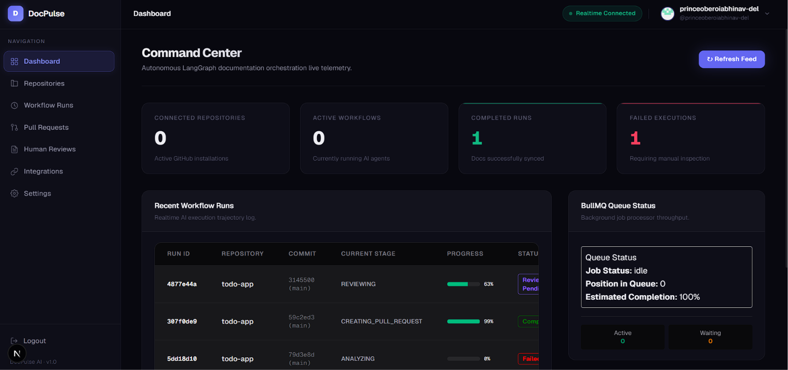
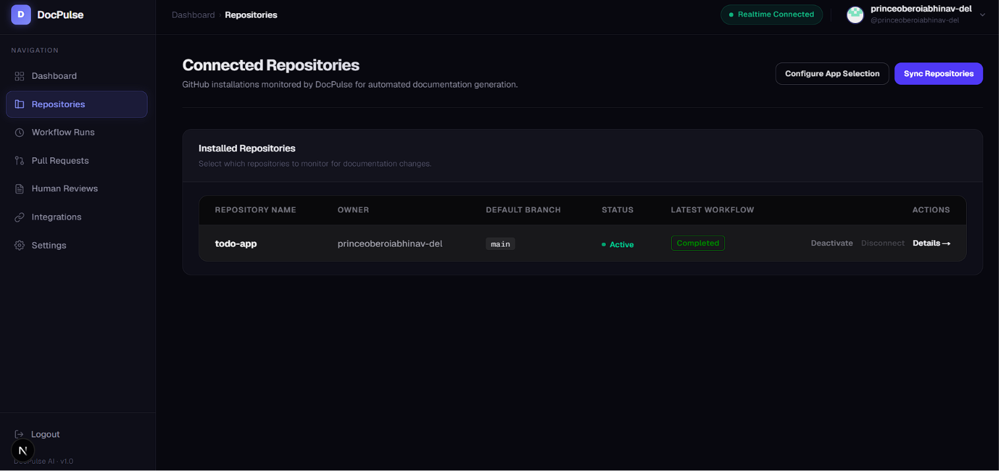
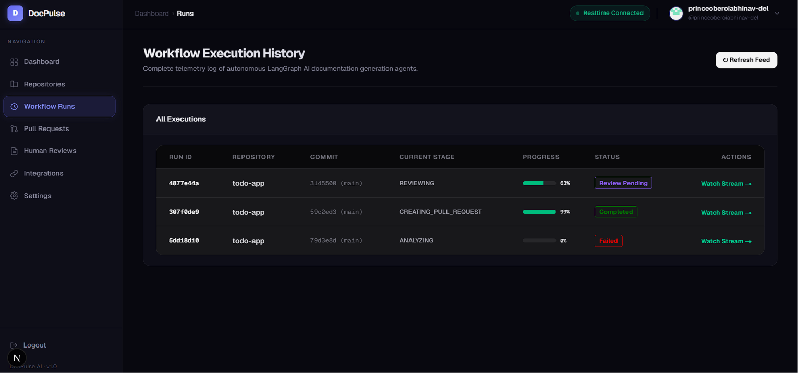
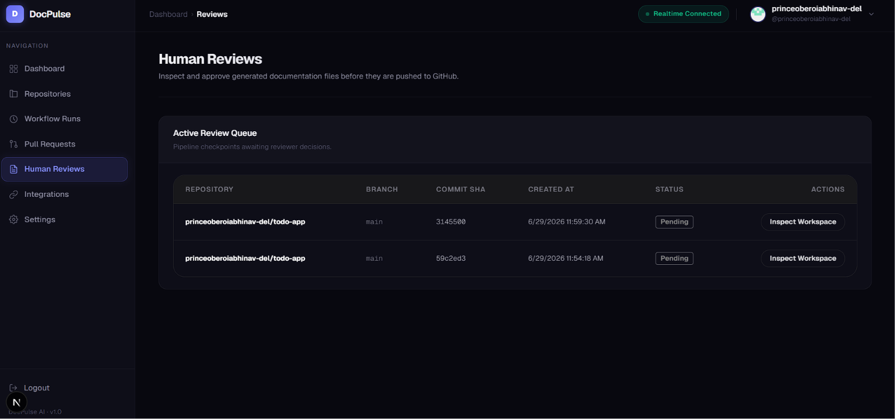
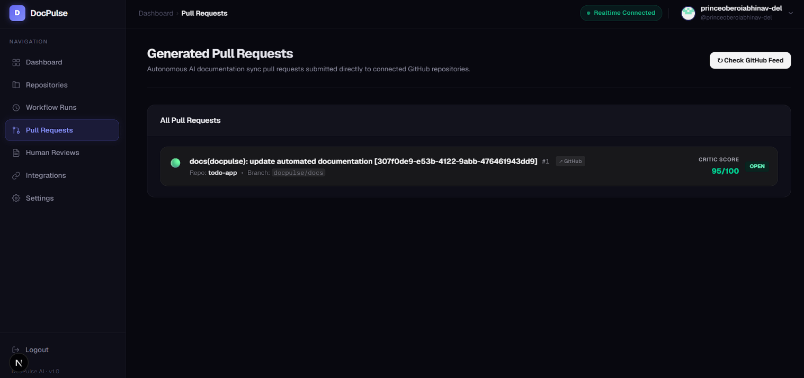
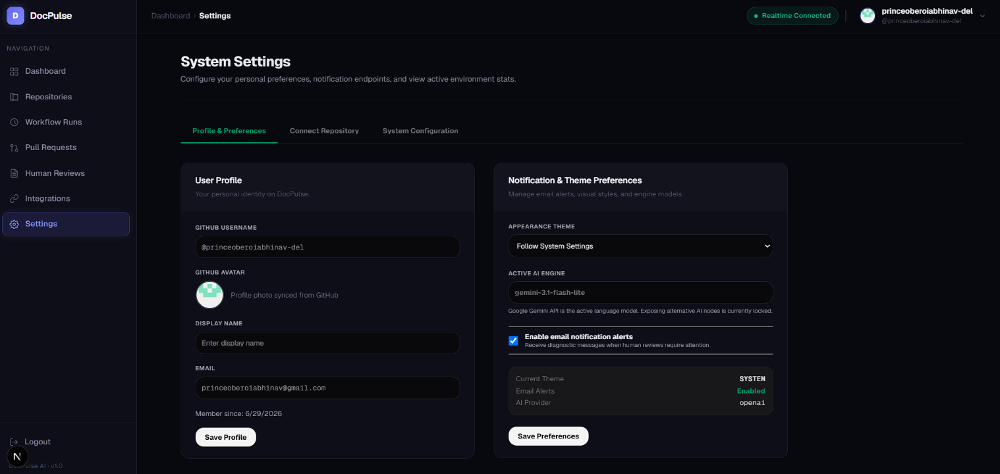

# DocPulse

AI-powered documentation automation platform for GitHub repositories.

DocPulse automatically analyzes source code, generates technical documentation using Large Language Models (LLMs), routes the generated documentation through a human review workflow, and publishes approved documentation back to GitHub as Pull Requests.

The platform combines AI agents, workflow orchestration, GitHub Apps, and real-time monitoring to provide an end-to-end documentation automation pipeline.

---

## Features

### AI Documentation Generation

- Automated repository analysis
- Context-aware documentation generation
- Previous documentation used as generation context
- Multi-stage AI workflow
- Multi-LLM architecture

### Workflow Orchestration

- LangGraph-powered workflow engine
- Checkpointing and workflow resumption
- Human-in-the-loop approval workflow
- Automatic retry handling
- Early skip support
- Real-time workflow execution tracking

### GitHub Integration

- GitHub App authentication
- Repository synchronization
- Secure webhook processing
- Automatic Pull Request creation
- Configurable branch strategies
- Custom documentation branch support

### Repository Management

- Repository activation and deactivation
- Documentation directory configuration
- Custom documentation paths
- Branch strategy management
- Repository settings management

### Dashboard

- Repository management
- Workflow monitoring
- Documentation review queue
- Pull Request tracking
- Real-time updates using Socket.IO
- Project analytics

### Reliability

- Unified LLM error handling
- Unified Git error handling
- Queue-based execution using BullMQ
- Workspace lifecycle management
- Automatic cleanup
- Fault-tolerant workflow execution

---

## Architecture

```text
                GitHub Push Event
                       │
                       ▼
               GitHub Webhook
                       │
                       ▼
               NestJS Backend API
                       │
                       ▼
              BullMQ Job Queue
                       │
                       ▼
            LangGraph Workflow Engine
                       │
        ┌──────────────┴──────────────┐
        │                             │
        ▼                             ▼
 Source Code Analysis         Existing Documentation
        │                             │
        └──────────────┬──────────────┘
                       ▼
          AI Documentation Generation
                       │
                       ▼
            Documentation Quality Review
                       │
             Human Approval Required
                       │
                       ▼
              Git Commit & Push Changes
                       │
                       ▼
            Automatic Pull Request Creation
```

---

## Technology Stack

### Frontend

- Next.js
- React
- TypeScript
- Tailwind CSS
- TanStack Query
- Socket.IO Client

### Backend

- NestJS
- TypeScript
- PostgreSQL
- Prisma ORM
- Redis
- BullMQ
- LangGraph
- GitHub App APIs

### AI

- LangGraph
- Multi-LLM Architecture
- Structured AI Agents

---

## Workflow

1. User installs the GitHub App.
2. Repository is connected to DocPulse.
3. GitHub Push Event triggers the workflow.
4. Repository is cloned.
5. Source code is analyzed.
6. Existing documentation is loaded as context.
7. AI generates updated documentation.
8. Generated documentation undergoes quality review.
9. User approves or requests regeneration.
10. Documentation changes are committed.
11. A Pull Request is automatically created.

---

## Screenshots

### Dashboard

<p align="center">
  
</p>

---

### Repository Management

<p align="center">
  
</p>

---

### Workflow Execution

<p align="center">
  
</p>

---

### Documentation Review

<p align="center">
  
</p>

---

### Pull Request

<p align="center">
  
</p>

---

### Settings

<p align="center">
  
</p>

---

## Getting Started

### 1. Clone the Repository

```bash
git clone https://github.com/rev-glory/doc-pulse
cd docpulse
```

### 2. Environment Configuration

Copy the example environment configuration file to `.env`:

```bash
cp .env.example .env
```

Open `.env` in a text editor and fill in the values. The environment variables are categorized below:

#### Required Build-time Variables (Frontend Only)
* **`NEXT_PUBLIC_API_URL`**: Base URL of the backend API (default: `http://localhost:3001`). Baked into static assets at build time.
* **`NEXT_PUBLIC_WS_URL`**: Base WebSocket URL of the backend (default: `http://localhost:3001`). Baked into static assets at build time.

#### Required Runtime Variables (Backend Only)
* **`DATABASE_URL`**: PostgreSQL connection string (defaults to container host inside Docker network).
* **`REDIS_URL`**: Redis connection URL.
* **`REDIS_PASSWORD`**: Redis authentication password.
* **`JWT_ACCESS_SECRET` / `JWT_REFRESH_SECRET`**: Signature secrets for JWT tokens (must be at least 32 characters).
* **`GITHUB_APP_ID` / `GITHUB_PRIVATE_KEY_BASE64` / `GITHUB_WEBHOOK_SECRET`**: Core credentials for GitHub App integration.
* **`GITHUB_CLIENT_ID` / `GITHUB_CLIENT_SECRET`**: Credentials for GitHub OAuth authentication.
* **`GEMINI_API_KEY`**: Your Google Gemini API Key.

#### Optional / Configuration Defaults
* **`PORT`**: Port the backend NestJS server listens on (default: `3001`).
* **`NODE_ENV`**: Execution context, set to `production` in container runs.
* **`LOG_LEVEL`**: Backend log verbosity (default: `log`).
* **`STORAGE_ROOT`**: Storage directory path for repository clones and cache assets (default: `./storage`).

---

## Running Locally

### Install Dependencies
Ensure you have Node.js >= 20 and pnpm installed, then execute:

```bash
pnpm install
```

### Start Services (Dev Environment)

1. Start local Postgres and Redis database instances:
   ```bash
   docker compose up postgres redis -d
   ```
2. Start the Backend API server (running in hot reload watch mode):
   ```bash
   pnpm --filter backend dev
   ```
3. Start the Frontend client dashboard:
   ```bash
   pnpm --filter frontend dev
   ```

---

## Running in Production Containers (Docker Compose)

DocPulse is fully containerized for production deployment. The entire stack can be launched using a single Docker Compose command.

### 1. Build Containers
Build the backend, database migrations, and frontend images using BuildKit caching optimizations:

```bash
docker compose build
```

### 2. Start all Services
Launch PostgreSQL, Redis, DB migrations, backend, and frontend services in detached background mode:

```bash
docker compose up -d
```

Compose automatically orchestrates service startups:
1. `postgres` and `redis` start first.
2. `db-migrate` applies schema migrations to `postgres` and exits.
3. `backend` starts up and connects to `postgres` and `redis`.
4. `frontend` starts up and connects to `backend`.

### 3. Verify Health States
Check if all containers are healthy and running:

```bash
docker compose ps
```

Confirm health endpoints respond with `"status": "ok"`:
* **Backend**: `curl http://localhost:3001/health`
* **Frontend**: `curl http://localhost:3000/api/health`

### 4. Stop Services
Stop all containers (retaining PostgreSQL and Redis volumes):

```bash
docker compose down
```

*For detailed instructions on PostgreSQL backups, database restores, volume cleaning, and container updates, please see the [DEPLOYMENT.md](file:///c:/Users/hp/Documents/Job-ready%20projects/doc-pulse/code/DEPLOYMENT.md) guide.*

---

## Key Implementations

- GitHub App Integration
- LangGraph Workflow Orchestration
- Queue-Based Background Processing
- Human-in-the-Loop Documentation Review
- Multi-LLM Provider Architecture
- Previous Documentation Context Injection
- Unified LLM Error Handling
- Unified Git Error Handling
- Configurable Branch Strategies
- Documentation Directory Support
- Early Skip and Workflow Cancellation
- Real-Time Workflow Updates
- Workspace Lifecycle Management
- Automatic Pull Request Generation

---

## Future Enhancements

- Authenticated cloning for private repositories
- Incremental documentation generation
- CI/CD pipeline
- Automated integration and end-to-end testing
- Notification system
- Monitoring and observability
- Additional LLM providers
- Advanced workflow analytics

---

## Author

**Abhinav Bansal**

GitHub: https://github.com/rev-glory

LinkedIn: https://linkedin.com/in/abhinav-bansal4
